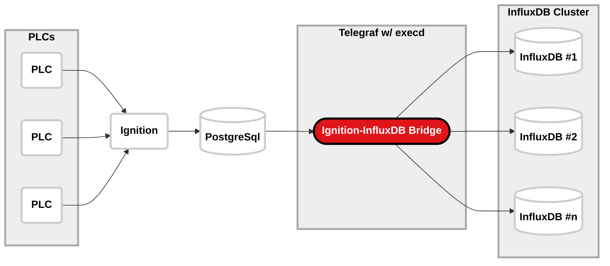

# Ingition-InfluxDB Bridge

This relatively simple Python script is designed to pull data from a PostgreSQL database populated by Ignition via its Tag Historian module and format that data for insertion into InfluxDB.

I'm using this program in production and it works well for me, but I'm not a professional Python programmer so I'm sure there are improvements that could be made. Let me know if you have any suggestions!

## How it Works

### [Ignition Tag Historian](https://inductiveautomation.com/ignition/modules/tag-historian)

I'm not going to cover configuring Ignition, OPC UA connections, or a lot of details about configuring the Tag Historian module here. Ignition's documentation is much better than mine.

In my application, I have a separate server running PostgreSQL. I created a very simple connection to the database in Ignition using the PostgreSQL JDBC driver. In the tag history configuration, I specified partitioning data into single day tables (so that I'm querying smaller tables). I also enabled data pruning after 90 days since I'm using InfluxDB for long term data storage.

With that configured, I configure history on tags within Ignition Designer and trust that Ignition will do the work of getting the data into PostgreSQL.

Once the data is in PostgreSQL, the Ignition-InfluxDB Bridge dynamically retrieves a list of tables containing relevant data and then retrieves the data from those tables.

### [Telegraf](https://www.influxdata.com/time-series-platform/telegraf/) & [`execd`](https://github.com/influxdata/telegraf/blob/master/plugins/inputs/execd/README.md)

I'm using Telegraf's `execd` plugin as a process manager for running the Ignition-Influxdb Bridge. The Python script is set to run continuously (with a delay of 5 seconds between each loop), and `execd` handles restarting the script if it ever stops running. It's not a super elegant configuration, but it works in my application.

Telegraf is great because it can be configured to output data to multiple InfluxDB targets at the same time. I run two InfluxDB servers and write my data to both in order to handle downtime on either server. Telegraf makes that trivial. The Ingition-InfluxDB Bridge simply prints data in [InfluxDB Line Protocol](https://docs.influxdata.com/influxdb/v2/reference/syntax/line-protocol/) format and Telegraf handles the rest. This eliminates the need for the Ignition-InfluxDB Bridge to know anything about the InfluxDB servers or configuration.

### Ignition-InfluxDB Bridge

The Ignition-InfluxDB Bridge essentially works by querying all data from the Ignition Historian database between the previous iteration end time and 10 seconds ago. If you've been running Ignition Historian for a while, this could cause problems because it may have to try to deal with a lot of data on the first pass. Each iteration, the end time is stored in Redis for retrieval on the next iteration.

Essentially, read the previous iteration end time from Redis (stored in ms since epoch) and add 1 millisecond to get the starting time for this iteration. Calculate the end time for this iteration. Retrieve the data between the two timestamps, print a line of Line Protocol for each record, and then update the end time in Redis for the next iteration.

## General Notes

One of the things I love about this setup is how easy it is to configure everything. Outside of my Ignition servers (I'm running Ignition in a HA setup), I have several cheap Apple Mac mini M1 computers running as my servers:

  - Mac mini running PostgreSQL
  - Mac mini running Telegraf
  - (2) Mac mini running InfluxDB
  - Mac mini running Grafana

I've been happy with the performance of these Mac mini computers (especially as sub-$1000 machines), and [Homebrew](https://brew.sh) makes configuration of all that software a breeze. I use [SuperDuper!](https://www.shirt-pocket.com/SuperDuper/SuperDuperDescription.html) to make nightly clones of each machine.

I know the script is light on error checking and handling, but I'm okay with that for now. If there's an error in my script, I still have all the data in the Ignition Historian database for 90 days, so I can adjust and retrieve data as needed.