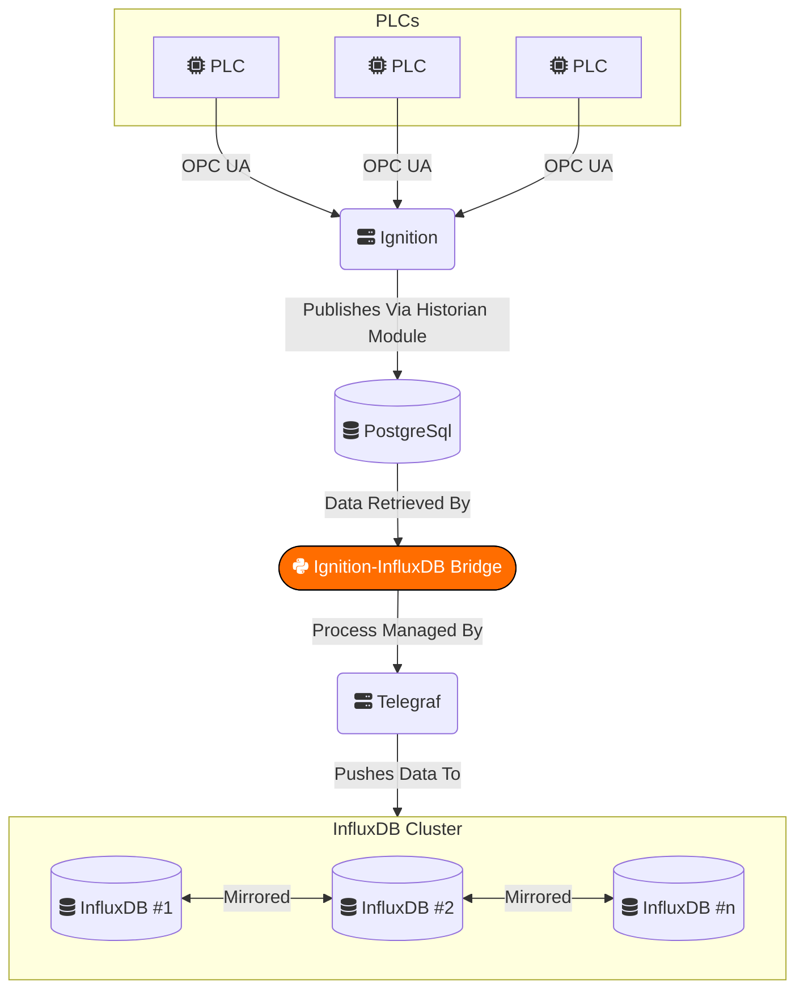

# Ingition-InfluxDB Bridge

This relatively simple Python script is designed to pull data from a PostgreSQL database populated by Ignition via its Historian module and format that data for insertion into InfluxDB.

I'm using this program in production and it works well for me, but I'm not a professional Python programmer so I'm sure there are improvements that could be made. Let me know if you have any suggestions!

## How it Works

